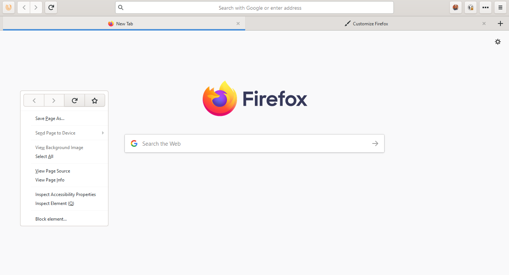
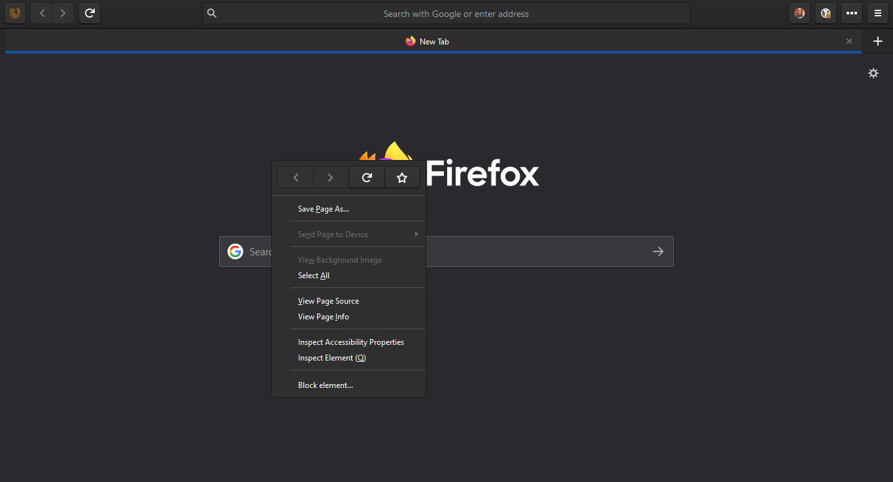
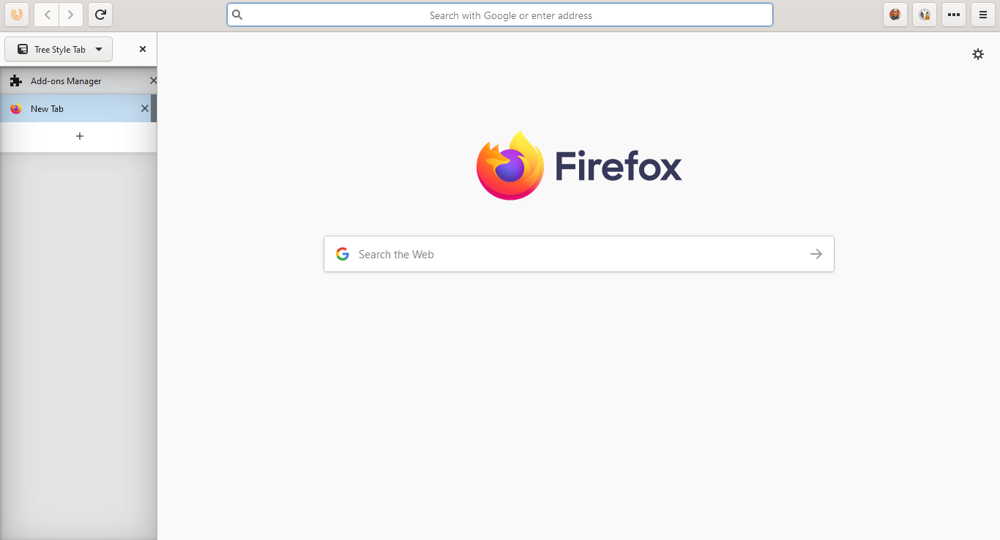
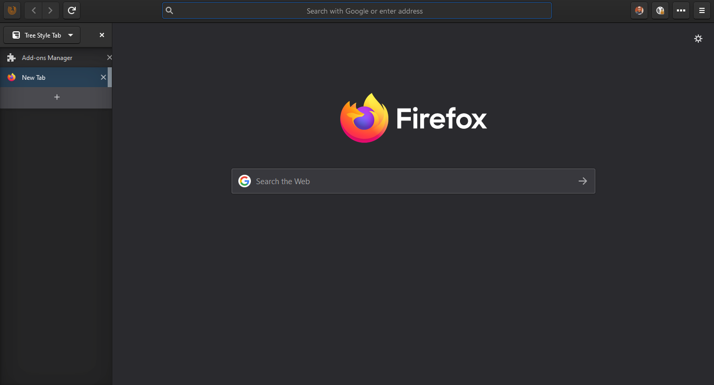

# firefox-gnome-theme-windows

### Forked from https://github.com/rafaelmardojai/firefox-gnome-theme

Had to completely disable the caption buttons as they overlap with the hamburger and overflow buttons. You can enable them by uncommenting the relevant import in theme/gnome-theme.css
  
I instead use the minMaxCloseButton.uc.js from https://github.com/xiaoxiaoflood/firefox-scripts#userchromejs-scripts with an orange firefox icon as seen in the screenshot.
  
I also use a scrollbar userscript(scroll.uc.js), a userscript to darken all tooltips(tooltips.uc.js) and a autohide_tabbar.uc.js to hide the tabbar when TST sidebar is open.
  
There are two color schemes called maia and yaru for both dark and light themes. You can enable them by uncommenting the relevant imports in gnome-theme.css.
  

## Screenshots

  

  

  

  
")
